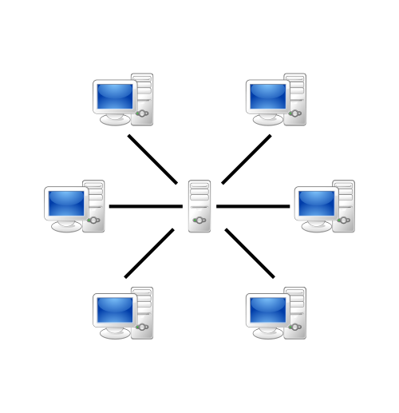
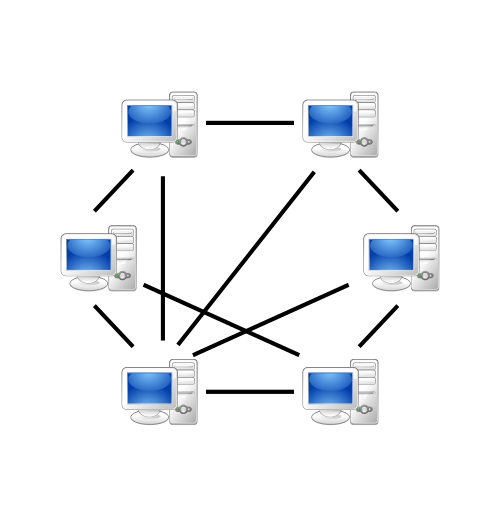
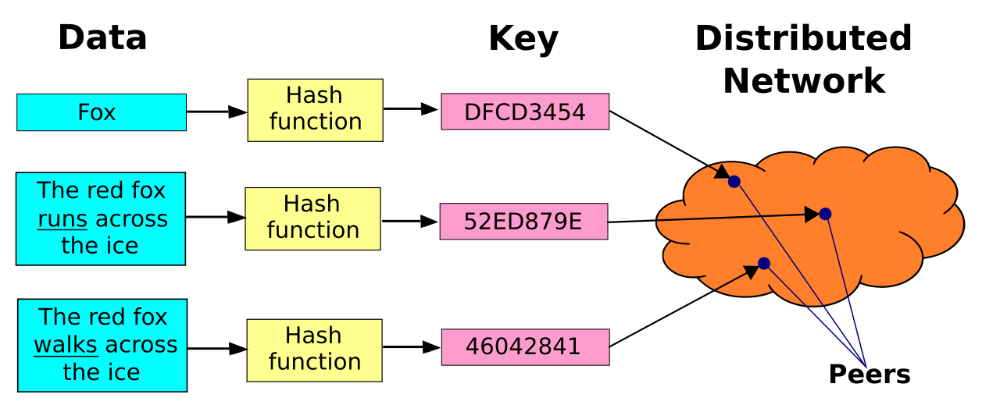
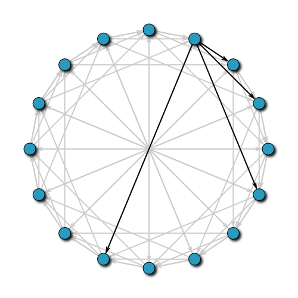
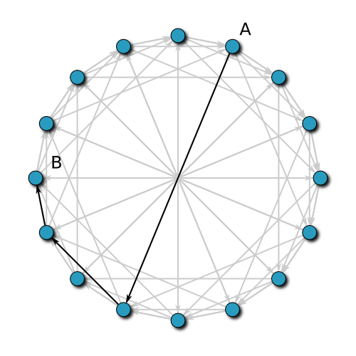
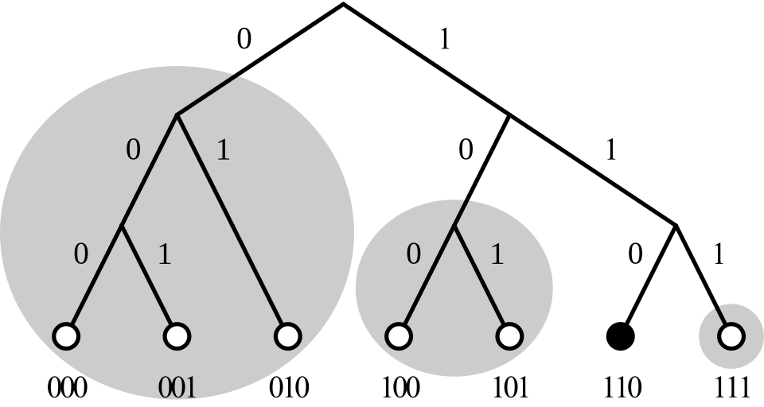

# 分布式哈希表

- **标题**: Distributed Hash Table
- **副标题**: Chord 与 Kademlia 协议
- 报告人：TfOi9
- 项目来源：https://github.com/TOmorrowarc1/DHT-ACMPPCA25
- 日期：2026.07.24

## 目录

- 引入
    - P2P 思想
    - DHT 的基本概念
- Chord 协议
    - 节点拓扑关系：循环链表
    - 加速查找：手指表
    - 动态更新：稳定化协议
    - 容错机制：后继列表与副本机制
- Kademlia 协议
    - XOR 距离度量
    - 节点结构与 k-桶
    - 核心算法：节点查找
    - 删除机制
- 应用：BitTorrent
    - 技术栈
    - 实现内容
    - 核心算法
    - 当前效果

## 引入

### P2P 思想

在网络通信中，一般都依赖中心化的服务器。但是中心化的结构的工作强依赖于中心服务器：一旦服务器下线或故障，就可能出现服务失效或数据丢失。



而如果我们采取点对点式的通信方法，让用户们直接相互通信，由于用户的庞大数目，这一系统的鲁棒性和可扩展性就大大提升。



基于这一思想，分布式哈希表应运而生。

### DHT 的基本概念

假如我们需要实现某个在线键值对查询服务：就像哈希表，需要支持键值对的插入、删除、查找，但是规模十分巨大，无法存在单一节点上。

我们采取分布式的存储方式：把要存储的键值对按某种协议均匀地分布在各节点上，这样，不仅解决了存储空间压力，少量节点的下线或故障也并不影响总体服务的正常运转、不会造成数据丢失。

但点对点通信也会引出问题：如何不依赖中心服务器，在网络中高效定位到某键的节点？当然，我们可以暴力地在每个结点保存所有其他节点的地址（完全图），但这显然是效率低且不鲁棒的选择：在大型网络中，每个结点要维护的信息量都非常大；并且，一旦某个节点加入或者下线，其他所有节点都需要更新路由表。



我们设计的协议的目标应当是：
1. 查找高效：在可接受数目（如 $O(\log N)$ 次）的查找内能够路由到目标节点；
2. 更新高效：单一节点状态变化不会影响大量节点；
3. 鲁棒性高：少量结点下线或崩溃不能使整个系统崩溃。


## Chord 协议
### 节点拓扑关系：循环链表

要实现 DHT 的路由机制，一种自然的想法是把各个结点排成一圈，模拟双循环链表，每个节点维护前驱与后继节点的地址：这确实解决了完全图中“牵一发而动全身”的缺点，但是最坏情况下需要遍历一整圈才能路由到目标节点。为了加速查找，我们可以对每一个节点维护倍增表，基于倍增思想把查找次数优化到 log 级别。这就是 Chord 协议的大致情况。



形式化地，我们对所有要插入的键和节点的 IP 地址做哈希（例如 SHA-1），哈希的值域是一个 $M$ 位的无符号整数。我们想象：把每一个可能的哈希值从小到大顺时针排在一个环上，环上还分布着一些节点，节点的位置即为其 IP 地址的哈希值。每一个键值对的存储由其直接的后继节点（在环上顺时针旋转，这一键后第一个遇到的节点处）负责。

### 加速查找：手指表

为了实现 $O(\log N)$ 级别的查找，我们需要利用倍增的思想，维护每个节点的倍增表。假如节点哈希值为 $H$，则倍增表的第 $i$ 级条目表示 $H + 2^i$ 的直接后继节点。

基于手指表，从任意节点开始，我们可以在 $O(\log N)$ 时间内，定位到任意哈希值的直接后继节点：按倍增表从大到小遍历，如果跳一步仍然没有跳过目标哈希值，则跳这一步；跳完后，我们就来到了目标节点的直接前驱的位置。这时查找其后继，就得到了目标节点。



基于此，我们可以实现键值对的插入与查找：从任意节点开始，路由到键的直接后继，在节点内部的哈希表中插入或查找即可。

可以写出如下的伪代码：
```
// 查找某哈希值的直接后继节点
n.find_successor(id):
    m = n.find_predecessor(id)
    return m.successor

// 查找某哈希值的直接前驱节点   
n.find_predecessor(id):
    m = n
    while id <= m.hash or id >= m.successor.hash:
        m = m.closest_preceding_node(id)
    return m

// 查找节点 n 到 id 的最近手指
n.closest_preceding_finger(id)
    for i = m downto 1:
        if n.hash < finger[i].hash < id:
            return finger[i]
    return n
```

### 动态更新：稳定化协议

我们的分布式系统中的节点并不是一成不变的：会有新节点动态加入，也会有老节点下线。但是，我们需要保证某节点的状态变化不会导致整个环的解体或者崩溃，节点网络能够自主地稳定化 Chord 环。

#### 稳定化循环

Chord 协议的稳定化采用定时循环的方式：每个节点每一定时后即检查并尝试修复可能的错误拓扑结构。

首先，我们需要保证后继节点地址的正确性。每次稳定化操作时，我们先查找当前节点 N 的后继节点 S 的前驱节点 P：这一节点理应是我们本身。如果我们发现 P 是另外的节点且 P 位于 N 的后面，则说明我们应该把后继更新为 P。随后，我们通知 P 我们可能是它的前驱。

此外，我们还需要更新手指表：每次稳定化时，我们选定一个随机的手指表条目，重新计算其正确的值并更新。

可以写出如下的伪代码：
```
// 周期性检查 n 的直接后继，并通知后继我们的存在
n.stabilize():
    x = n.successor.predecessor
    if n.hash < x.hash < n.successor.hash:
        n.successor = x
    n.successor.notify(n)

// m 认为它可能是 n 的前驱
n.notify(m):
    if n.predecessor = nil
            or n.predeccessor.hash < m.hash < n.hash:
        n.predeccessor = m

// 修复 n 的手指表
n.fix_finger():
    i = random finger index
    n.finger[i] = find_successor(n.hash + 2^i)
```

#### 节点加入

有了上述的稳定化协议，我们的节点加入操作就十分简单了：我们直接查找该节点的后继，按此设定后继，前驱直接设为 nil；在一段时间的稳定化操作后，各个节点的前驱、后继与手指表都会自动收敛到正确状态。
```
// 用 m 作为介绍人节点，让新节点 n 加入 DHT 网络
n.join(m):
    n.predecessor = nil
    n.successor = m.find_successor(n.hash)
```

此外，我们需要处理键值对的迁移：我们需要在新节点加入网络后，向它的后继节点发送请求，转移新节点负责的键值对。

#### 节点优雅退出

类似于加入，节点的优雅退出只需要更新前驱的后继字段和后继的前驱字段，并把本节点的全部键值对转移到后继节点，剩下的仅需等待稳定化协议自动修复。

### 容错机制：后继列表与副本机制

在网络系统中，我们需要应对节点宕机的情况：假如我们的循环网络中有某个节点因意外下线，未能正常调用优雅退出过程，那么我们的环形网络将会断裂；此外，该节点负责的键值对将会全部丢失。我们需要引入容错机制，不仅确保环不断裂，还保存键值对的副本，防止宕机导致数据丢失。

具体地，对每个节点，我们维护长度为 $r$ 的后继列表，里面含有直接后继到 $r$ 阶后继。每次查找后继是，如果发现后继节点已死，则取后继列表中第一个存活的节点作为后继。这样，除非某结点后的 $r$ 个后继全部意外下线（概率极低），否则环不会断裂。

此外，我们把每个节点的键值对复制到这 $r$ 个后继中。这样，当查找键值时，如果目标节点已死，可以继续在后继节点的副本中查找目标键值。此时，删除操作不仅需要在目标节点内部删除，还需要遍历其后继，删除副本。

## Kademlia 协议
### XOR 距离度量

在 Chord 协议中，我们自然地把各个结点按照哈希值排序，并加入了环形的拓扑关系。但是，在后续各种操作的设计中，我们发现维护一个完整的环其实是较为困难、细节处理复杂的。Kademlia 协议走了完全不同的一条路线：完全忽略结点间的显式拓扑关系，通过哈希值的 XOR 来度量距离。

XOR 操作天生满足距离的性质：
1. 非负性：$a \oplus b \geq 0$，当且仅当 $a = b$ 时取等号.
2. 对称性：$a \oplus b = b \oplus a$.
3. 三角不等式：$a \oplus b + b \oplus c \geq a \oplus c$.

在 Kademlia 协议中，我们采取 XOR 距离来定义哈希值之间的距离。我们假设哈希算法采用 SHA-1，哈希值域是 160 位无符号整数。

Kademlia 协议的基本思想是：我们不维护节点间显式的拓扑关系，而是基于距离组织各个结点，每个键值对由距离它最近的结点负责维护；在结点的相互通信中不断更新每个结点的路由表，让它们逐渐了解整个网络。



### 节点结构与 k-桶

在 Kademlia 协议中，各个结点的路由表是基于一种叫做 k-桶 的数据结构来维护的：每个 k-桶 的大小上限固定为常数 $K$，而每个结点持有 160 个 k-桶，第 $i$ 个 k-桶 维护到本节点距离在范围 $[2^i, 2^{i + 1})$ 内的已知结点。

在单个 k-桶 中，各个邻居结点的插入与删除基于类似 LRU 缓存的算法：每个 k-桶 中的邻居结点按上次访问时间从远到近排序：若有剩余空间则直接尾部插入；否则，我们 Ping 头部结点（最久没有访问过的节点），如果它已经死了，则从列表中删除，插入新节点；否则，丢弃新节点，更新头部结点的访问时间并挪到尾部。

上述机制可以保证：如果有网络攻击，黑客注册大量间谍节点试图加入 DHT 网络，此时只要我们的旧节点保持在线，各个节点的路由表就不会迅速被间谍节点迅速填充，从而起到防范网络攻击的作用。

### 核心算法：节点查找
#### 四个 RPC 方法

Kademlia 协议的 RPC 方法非常简单，仅有以下四种：

1. `PING` - 连通性检测，用于探测节点是否在线；
2. `STORE` - 要求某结点存入某键值对；
3. `FIND_NODE` - 查找当前节点的路由表中距离目标键值最近的 $K$ 个节点；
4. `FIND_VALUE` - 查找当前节点中是否有目标键值，如有则返回，否则返回当前节点的路由表中距离目标键值最近的 $K$ 个节点。

按照 Kademlia 协议的基本思想，每一个 RPC 方法被调用时，双方都会尝试把对方插入自己的路由表。

根据 k-桶 的设计，`FIND_NODE` 的实现是简单的：从前往后依次遍历 k-桶，取出距离最小的前 $K$ 个节点即可。

#### 节点查找算法

我们需要基于 `FIND_NODE` RPC，设计查找距离当前节点最近的 $K$ 个节点的算法。Kademlia 的原论文提出了以下的算法：

首先，我们设定并行度 $\alpha$ （一般为 3）；我们先取出距离当前节点路由表中距离最小的 $K$ 个节点，称为 `shortlist`。每次，我们取出 `shortlist` 中距离我们最近且未访问过的 $\alpha$ 个节点，**并行**地对它们调用 `FIND_NODE` RPC，并把返回的列表合并回 `shortlist`，同时保持 `shortlist` 按距离有序。当 `shortlist` 中各个结点都被访问过时结束算法。可以证明，这一算法的时间复杂度是 $O(\log N)$ 的。

#### 容错机制

Kademlia 算法也需要实现容错机制，用于防范节点的突然宕机。具体方法是，我们不仅把键值对存在距离最近的结点中，而是同时把它们储存在距离最近的 $K$ 个节点中。这样，单一节点宕机并不会导致数据丢失；没了显式的拓扑关系，节点宕机也并不影响路由表的组织：k-桶 中的已死节点会逐渐被其他节点替代。

#### 插入与查找算法

基于上述基础，插入和查找的设计是自然的：插入仅需查找距离目标键最近的 $K$ 个结点并并行地对它们调用 `STORE` RPC；查找节点直接就是上述节点查找算法，只不过调用的 RPC 需要改为 `FIND_VALUE`，查到值则提前结束。

#### 节点加入

节点的加入也可以基于节点查找算法实现：首先，我们需要一个“介绍人”节点，并在新节点的路由表中添加该节点。随后，我们“自举”地对新节点调用查找自身哈希值的算法，这样可以同时填充新节点的路由表，也把新节点加入邻居的路由表中。最后，我们可以从邻居处拉取到新节点比到邻居更近的键值对，存储于新节点中。

### 删除机制

标准的 Kademlia 协议没有提供删除操作，但提供了键值对的重新发布机制：每一定时间（一般是 24 小时），所有节点的键值对都会清空，由键值对的发布者根据情况重新发布键值对。如果需要删除，那么在数据清空后，键值对发布者可以选择不发布需要删除的对应键值对。

但是，我们可以“强行”加入一个删除算法：我们查找距离目标键最近的 $K$ 个节点，并向它们发送 RPC，要求它们删除对应键值对。这一看上去暴力的算法可以通过测试，但可以证明是有问题的：假如某一持有该键值对的节点在删除操作被调用前下线，在删除操作完成后又重新上线，那么该节点中就残留着对应的键值对。

## 应用：BitTorrent
请见 [BitTorrent](./bittorrent.md) 文档。

### References

I. Stoica et al., "Chord: A scalable peer-to-peer lookup service for internet applications," *ACM SIGCOMM CCR*, vol. 31, no. 4, pp. 149-160, 2001. [DOI](https://doi.org/10.1145/964723.383071)

P. Maymounkov and D. Mazières, "Kademlia: A Peer-to-Peer Information System Based on the XOR Metric," in *IPTPS 2002*, LNCS 2429, Springer, 2002, pp. 53-65. [DOI](https://doi.org/10.1007/3-540-45748-8_5)

Wikipedia, "Distributed hash table," 2026. [Online]. Available: https://en.wikipedia.org/wiki/Distributed_hash_table (accessed Jul. 23, 2026).

Wikipedia, "Chord (peer-to-peer)," 2026. [Online]. Available: https://en.wikipedia.org/wiki/Chord_(peer-to-peer) (accessed Jul. 23, 2026).

Wikipedia, "Kademlia," 2026. [Online]. Available: https://en.wikipedia.org/wiki/Kademlia (accessed Jul. 23, 2026).

TOmorrowarc1, "DHT-ACMPPCA25," GitHub repository. [Online]. Available: https://github.com/TOmorrowarc1/DHT-ACMPPCA25

TfOi9, "DHT," GitHub repository. [Online]. Available: https://github.com/TfOi9/DHT

TfOi9, "BitTorrent," GitHub repository. [Online]. Available: https://github.com/TfOi9/BitTorrent